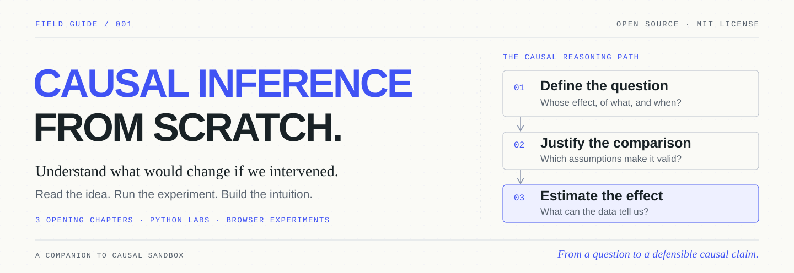
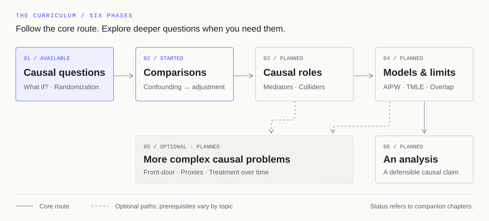

<picture>
  <source media="(max-width: 600px)" srcset="assets/banner-mobile.svg">
  
</picture>

<p align="center">
  <strong><a href="https://kirilklein.github.io/causal-inference-from-scratch/">Read the website</a> · <a href="phases/01-causal-questions/01-what-if/README.md">Start on GitHub</a> · <a href="https://kirilklein.github.io/causal-sandbox/?lesson=what-if">Open the interactive lab</a> · <a href="CURRICULUM.md">Explore the curriculum</a></strong>
</p>

<p align="center">
  <a href="https://github.com/kirilklein/causal-inference-from-scratch/actions/workflows/ci.yml"></a>
  <a href="LICENSE"></a>
  
</p>

**A treatment helps every patient. The treated group still looks worse. Why?**

Learn to answer questions like this by changing a simulated world, explaining what happens, and reproducing the calculation yourself. This is the written and coding companion to **[Causal Sandbox](https://kirilklein.github.io/causal-sandbox/)**, with browser experiments at the center of each lesson.

Inspired by Rohit Ghumare's **[AI Engineering from Scratch](https://github.com/rohitg00/ai-engineering-from-scratch)**. We adapt its phased course, runnable labs, and optional tutor format to causal inference. The lessons and artwork here are original; the interactive experiments come from Causal Sandbox.

**Available now:** three opening chapters, each with a guided experiment, a Python lab, exercises, and worked solutions. The six-phase curriculum below is the expansion plan. Existing Sandbox lessons and unwritten companion chapters are clearly distinguished in the [full roadmap](CURRICULUM.md).

## Choose your way in

| I want to… | Start here |
| --- | --- |
| **Understand the ideas** | [Read chapter 1](phases/01-causal-questions/01-what-if/README.md) and open its browser experiment. No installation or coding required. |
| **Build the calculations** | [Clone and run a lab](#run-it-yourself). All opening labs use Python's standard library. |
| **Learn with a tutor** | [Use the course skill](#study-with-a-tutor) in a coding assistant. Predict, discuss, and save your progress. |
| **Explore freely** | [Try a scenario](https://kirilklein.github.io/causal-sandbox/?sandbox) or [build a causal graph](https://kirilklein.github.io/causal-sandbox/?sandbox=graph-lab). |

Start with everyday reasoning about averages. Each chapter introduces its own notation. Basic Python helps on the coding path; it is optional for the reading and browser paths.

## Start with three questions

| Chapter | What you will learn to explain | Open the experiment |
| --- | --- | --- |
| **01 · [What if?](phases/01-causal-questions/01-what-if/README.md)** | Which comparison defines a causal effect, and which outcome is missing? | [Two possible futures](https://kirilklein.github.io/causal-sandbox/?lesson=what-if) |
| **02 · [A randomized comparison](phases/01-causal-questions/02-randomization/README.md)** | Why does randomization work on average, even when one study is imbalanced? | [Randomized studies](https://kirilklein.github.io/causal-sandbox/?lesson=randomization) |
| **03 · [When treatment selection changes the comparison](phases/02-learning-from-comparisons/01-confounding/README.md)** | How can more data make a biased answer more precise? | [A common cause](https://kirilklein.github.io/causal-sandbox/?lesson=confounding) |

The opening lab makes the puzzle concrete: the simulator's average treatment effect is **+12**, but the observed treated-minus-untreated difference is **−8.27**. The next chapters explain why those comparisons differ and when an observed comparison can estimate a causal effect.

## How a lesson works

**Question → Predict → Experiment → Explain → Implement → Challenge**

Define the comparison. Commit to a prediction. Change one part of the simulated world. Explain the result, then reproduce the idea in a short Python program. Finish by applying it to an unfamiliar situation.

You leave with code you understand and a causal argument you can defend. Solutions are separate from exercises so you can try before looking.

```text
phases/01-causal-questions/01-what-if/
├── README.md           The question, experiment, and explanation
├── code/simulation.py  A runnable implementation
├── exercises.md        Prediction and transfer questions
└── solutions.md        Worked reasoning
```

## The course at a glance

[](CURRICULUM.md)

| Phase | Focus | Companion course status |
| --- | --- | --- |
| **01 · Causal questions** | Potential outcomes and randomization | Two chapters available |
| **02 · Comparisons** | Confounding, uncertainty, IPW, outcome regression | Confounding available; remaining chapters planned |
| **03 · Causal roles** | Mediators, colliders, hidden confounding | Planned; browser lessons exist |
| **04 · Models and limits** | Misspecification, AIPW, TMLE, overlap | Planned; browser lessons exist |
| **05 · Deeper questions** | Front-door identification, proxies, treatment over time | Optional branches; companion chapters planned |
| **06 · An analysis** | Define, justify, estimate, diagnose, and report | Planned; extends the Sandbox's closing lesson |

The core route goes from phase 04 to phase 06. Phase 05 offers optional branches with their own prerequisites. Further proposed additions include instrumental-variable estimation, difference-in-differences, regression discontinuity, and target-trial emulation. See the [curriculum](CURRICULUM.md) for scope and prerequisites.

## Run it yourself

Python **3.10 or newer**. No third-party packages.

```bash
git clone https://github.com/kirilklein/causal-inference-from-scratch.git
cd causal-inference-from-scratch
python3 phases/01-causal-questions/01-what-if/code/simulation.py
```

Then explore random assignment and confounding:

```bash
python3 phases/01-causal-questions/02-randomization/code/simulation.py
python3 phases/02-learning-from-comparisons/01-confounding/code/simulation.py
```

The labs are small teaching models. They explain the same ideas as the browser lessons without reproducing every browser setting or dataset. All people and outcomes are fictional; health scores are illustrative units.

## Study with a tutor

After cloning, give a coding assistant access to this checkout and ask:

> Use `skills/learn-causal/SKILL.md` to teach me this course. Start with the first lesson and wait for my predictions.

The [tutor skill](skills/learn-causal/SKILL.md) guides the experiments, asks one exercise at a time, and can save your reasoning and review topics in an ignored `CAUSAL-LEARNING.md` file. It works as a local instruction file without installation. For automatic discovery, copy its folder into your assistant's supported skill directory.

The tutor needs the course checkout, not just the skill file. Browser and tutor progress remain separate, and progress is a study record rather than a claim of validated mastery.

## What the simulator knows

The simulator retains both potential outcomes for each person. The analyst sees only the outcome under the treatment actually received. **Simulator truth is a benchmark, never a missing value supplied to an estimator.**

A correct result in a toy world does not establish that its assumptions hold in your study. Each lesson asks you to explain both the result and the limits of the comparison.

## Course checks and publishing

[GitHub Actions](https://github.com/kirilklein/causal-inference-from-scratch/actions/workflows/ci.yml) runs numerical tests, checks the curriculum and local links, executes every available lab, and verifies the README artwork on Python 3.10 and 3.13.

```bash
python3 -m unittest discover -s tests -v
python3 scripts/check_course.py
python3 scripts/export_diagrams.py --check
```

The [reading website](https://kirilklein.github.io/causal-inference-from-scratch/) is generated from `course.json` and these same Markdown chapters. It includes chapter search, separate exercises and solutions, downloadable Python labs, and optional reading marks saved in your browser. Causal Sandbox continues to host the interactive experiments.

To preview the website, install Node.js 22 or newer and run:

```bash
npm ci
npm run build
npm run preview
```

Open <http://127.0.0.1:4173/causal-inference-from-scratch/>. Website checks run in pull requests; deployment runs after all website and course checks pass on `main`. See [automation and publishing](docs/automation.md) for setup and validation.

## Sources, credit, and contributions

- **Course format:** Rohit Ghumare's [AI Engineering from Scratch](https://github.com/rohitg00/ai-engineering-from-scratch), including its phased structure, runnable artifacts, tutor approach, and reference-manual presentation.
- **Interactive lessons:** [Causal Sandbox](https://github.com/kirilklein/causal-sandbox). The initial curriculum mapping uses [`57fd76c`](https://github.com/kirilklein/causal-sandbox/tree/57fd76c6a33e5610bdd7524aecf7da3ee06385ac); live browser lessons may evolve.
- **Theory:** Hernán and Robins, [*Causal Inference: What If*](https://miguelhernan.org/whatifbook), especially chapters 1–3 for the opening sequence.

Corrections, clearer explanations, and new exercises are welcome. Read [CONTRIBUTING.md](CONTRIBUTING.md) before extending the course. Code, course material, and original artwork are available under the [MIT license](LICENSE).
